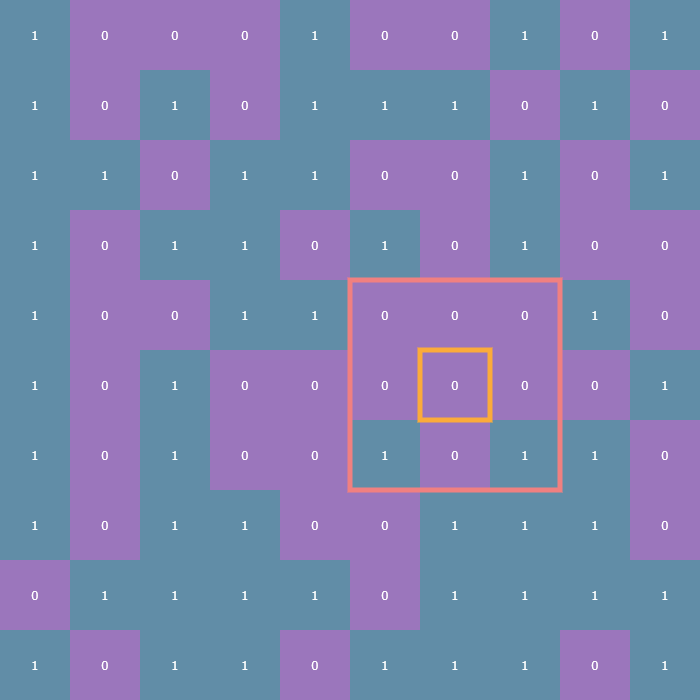
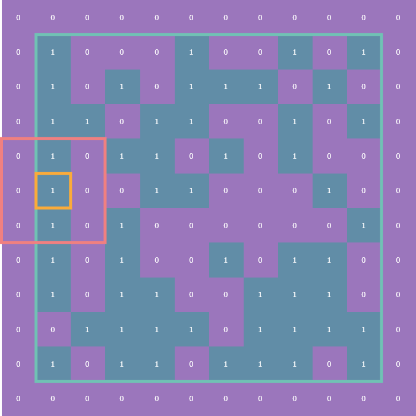
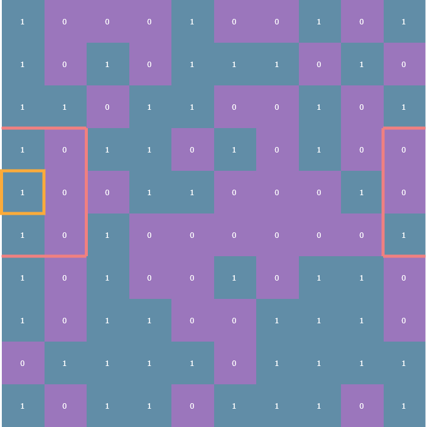
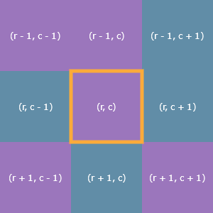
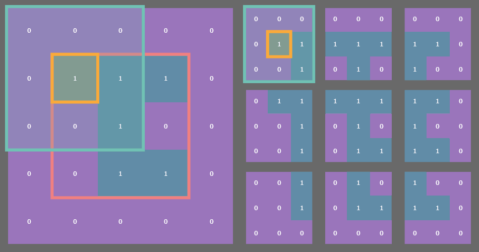

# life

Conway's game of life with options for fixed or periodic boundary conditions.

<!--  -->

## Intro

I had always been very intrigued by [Conway's Game of Life](https://en.m.wikipedia.org/wiki/Conway%27s_Game_of_Life) but had never actually implemented it myself. When I looked up the ruleset, I realized I had no excuse.

For those unfamiliar, Conway's Game of Life (which I'll refer to as **Life** going forward) is what is known as a [cellular automaton](https://en.m.wikipedia.org/wiki/Cellular_automaton). Life is a 2-dimensional array of cells which observe a binary state: either on or off, alive or dead.

Going forward I'm going to be referring to a **game board** (or just **board**) and the state of Life at any given time as **state**.

The state of the game board at time `t` is entirely determined by the state of the board at time `t - 1`, and is governed by this ruleset:

1. **Underpopulation:** a live cell with <= 1 live neighbors dies
2. **Survival:** a live cell with 2 or 3 neighbors survives
3. **Overpopulation:** a live cell with >= 4 live neighbors dies
4. **Reproduction:** a dead cell with exactly 3 neighbors is reborn

Those are the original rules, but they can actually be distilled down to only three rules:

> 1. Any live cell with two or three live neighbors survives.
> 2. Any dead cell with three live neighbors becomes a live cell.
> 3. All other live cells die in the next generation. Similarly, all other dead cells stay dead.

[(source)](https://en.m.wikipedia.org/wiki/Conway%27s_Game_of_Life#Rules)

## The algorithm

The basic algorithm for implementing Life is as follows:

1. Check each cell on the game board, counting how many neighbors it has
2. Determine whether that cell should die, survive, or be reborn
3. Update each cell on the game board

Each cell's neighborhood consists of the eight cells adjacent to it (up, down, left, right, and the diagonals).

## Each cell is a finite automata!

The word **state** in this section will specifically refer only to the state of an individual cell.

Since there are two states in which a cell can be observed (alive or dead), and anywhere from 0 to 8 neighbors, it's entirely possible to enumerate all the possible state transitions as the cartesian product of \(\{0, 1\} \times \{0,1,\dots,8\},\) for a total of 16 possible state transitions. Familiarity with [discrete finite state machines](https://en.m.wikipedia.org/wiki/Finite-state_machine) is helpful here, but not necessary.

Here are a few examples from those 16 state transitions:

```text
(0, 5) -> 0
(1, 3) -> 1
(1, 6) -> 0
(0, 3) -> 1
```

The way to read these state transitions is from left to right: on the left hand side is a 2-tuple containing the current state of any given cell \(c\) and the number of *live* neighbors it has, and the right hand side is the next state of the cell \(c.\) So for instance, the state transition `(0, 5) -> 0` applies to any cell which is dead (the `0` in the 2-tuple) and which has five living neighbors (the `5` in the 2-tuple). As you can see, the next state of that cell is 0, meaning the cell stays dead.

Notice that the vast majority of the state transitions are equivalent based on those three rules from earlier. There's no functional difference between `(0, 5) -> 0` and `(0, 7) -> 0`.

Taking this into account, there are actually only three state transitions which we need to consider:

```text
(1, 2) -> 1
(1, 3) -> 1
(0, 3) -> 1
```

The first two transitions reflect the first rule:

> Any live cell with two or three live neighbors survives.

And the third transition reflects the second rule:

> Any dead cell with three live neighbors becomes a live cell.

Every other possible state (again, a 2-tuple `(alive or dead, number of neighbors)`) results in either a live cell dying or a dead cell staying dead.

## Implementation

### Glossary

Here are some of the terms I'l be using in this section:

<...>

Conventionally, most implementations take a looping approach where each cell is checked one-by-one. I decided to take advantage of NumPy's vectorization to simplify the calculations with the tradeoff being that the initial set up was a little bit more complicated to figure out. We'll go through the implementation here step-by-step. It may help to have `life.py` open somewhere to which you can refer, however the relevant code will also be shown here.

### Updating `state`

The easiest place to start is in encoding the rules of Life. The three state transitions we care about become

```python
RULES = {(1, 2): 1, (1, 3): 1, (0, 3): 1}
```

Choosing this particular data structure meant I needed to write a function which could accept a 2-tuple of the elements from two arrays: the `state` array and the `neighbors` array. For this, I use `np.vectorize()`:

```python
NEXT_STATE = np.vectorize(lambda x, y: LifeFactory.RULES.get((x, y), 0))
```

Here, I'm passing an anonymous function which takes two arguments, `x` and `y`, each representing a single element at the same position in `state` and `neighbors` respectively. The `np.vectorize()` function returns a `Callable[[np.ndarray, np.ndarray], np.ndarray]` which is assigned to `NEXT_STATE`.

The `NEXT_STATE` function now takes the `state` and `neighbors` arrays as arguments and constructs a new array by getting values based on the `RULES` dictionary lookup. In other words, in order to get the next **generation**, I just need to call `NEXT_STATE(state, neighbors)`.

This hefty layer of abstraction allows me to focus on the next piece of the puzzle: calculating each cell's number of living neighbors.

### Neighborhoods and boundary conditions

The rules of the Game of Life entirely revolve around how many living neighbors a given cell has. Typically, a **neighborhood** is considered to be the 8 cells surrounding any given cell:



For cells not on the edge of the array finding the number of neighbors is trivial, just look at each cell in all eight directions and count how many of those cells are alive. The tricky part comes in how to deal with cells on the edge of the array.

There are two variants on what are known as **boundary conditions.** The first is the **fixed** boundary condition wherein all the cells adjacent to those on the edge of the array are considered dead (think of it as a wall of zeros surrounding the entire array):



The other is the **periodic** boundary condition which means that each edge of the array essentially "wraps" around to the other side so that, for instance, cells on left edge of the array are considered to be adjacent to the cells on the right edge:



### Finding `neighbors`

Now, you could write a nested `for` loop over the `r, c` (row, column) coordinates of each neighbor of a given cell,



But that in and of itself is a nightmare, let alone having to deal with the boundary conditions. Instead, we'll "pad" the `state` array with a 1-cell-wide border and use a \((3 \times 3)\) sliding window!

### Stride tricks

NumPy's arrays are truly remarkable. Because they are homogeneous, each element in any given array requires the exact same amount memory as every other element in that array. For example, a six-element vector of `int8` (integers represented using only 8 bits, of which there are \(2^8 = 256\)) would take up exactly 48 bits (or six bytes) in memory. In the following examples I'll use `dtype="uint8"` which is an **unsigned** integer, so the possible values are 0-255.

```python
>>> import numpy as np
>>> x = np.array(0, 255, size=(6,), dtype="uint8")
>>> x
array([133, 195,  41, 201, 208,  60], dtype=uint8)
>>> x.size * x.itemsize  # itemsize is in units of bytes
6
```

This fixed-memory-per-element constraint allows NumPy to carve out a contiguous chunk of memory, which in turn makes accessing the elements of a given array a lot faster because NumPy doesn't have to do any wonky fiddling with pointers to jumpy around memory grabbing elements like pure Python has to do with its `list` type. We can get a feel for this by checking `np.ndarray.strides`:

```python
>>> x.strides
(1,)
```

For a 1D array, this is telling us that in order to "travel" to the next element in the array, we simply need to increment by one byte. This pattern follows for higher-dimensional arrays:

```python
>>> x = np.random.randint(0, 255, size=(3, 3), dtype="uint8")
>>> x.strides
>>> (3, 1)
```

This is telling us that in order to travel to the next row we increment by 3 bytes. Columnar jumps still only require 1 byte because data in NumPy is stored in column-order by default (and 1 byte because in these examples I'm using `dtype="uint8"`). Go ahead, see for yourself:

```python
>>> x
array([[218,  19,  18],
       [ 32, 227, 144],
       [152,  44,  64]], dtype=uint8)
```

Moving from `19` to the next row takes three bytes; one byte to reach `18`, one byte to reach `32`, and finally one more byte to reach `227` which is directly below `19`.

What does any of this have to do with Conway's Game of Life? Well, the way I got around dealing with that indexing nightmare was by padding the original `state` array with a 1-cell-wide border and using `stride_tricks` to take a `(3, 3)` sliding window view into the `state` array with its border:

```python
padded = LifeFactory.pad(state, **kwds)
windows = np.lib.stride_tricks.sliding_window_view(padded, (3, 3))
```

Here, `LifeFactory.pad()` is a static method of the `LifeFactory` factory class which takes `state` and pads it with either a border of zeros for a fixed-boundary game (original `state` outlined in pink):


Or, the `.pad()` function returns the original `state` with periodic boundaries, which I'll cover in the following section. For now, let's focus on that ridiculously long function name being called for the assignment to `windows`.

### Sliding windows

The `np.lib.stride_tricks.sliding_window_view()` function provides a sequence of views of the input array by directly messing with striding. The implementation details aren't super important, the real key here is that this function returns an array of a very special shape: `(n, n, 3, 3)` where `n` is the original size of the array (I've restricted my implementation to square arrays simply for aesthetics; in general, for an original array of size `(n, m)`, after padding, the sliding window views will be a `(n, m, 3, 3)` array).

For example, if you have a `state` array which is `(4, 4)`, *then the sliding window function returns a* `(4, 4)` *array of* `(3, 3)` *arrays.* See where I'm going with this? Essentially, you get a `(4, 4)` array of each of the original array's `(3, 3)` neighborhood! Here's an example with a `state` array of dimensions `(3, 3)` and using fixed dimensions. Here, the original array is outlined in pink.



### Counting neighbors

The whole point of this was to figure out how many living neighbors a given cell has. Once we've gotten our `windows` array (remember, its shape is `(n, n, 3, 3)`), we can call `np.sum()` to take the sum of each neighborhood subarray:

```python
windows.sum(axis=(2, 3)) - state
```

The `axis` argument here specifies that we're summing over the third and fourth axes (remember that Python is zero-indexed). One way to think of it is that that each `(3, 3)` neighborhood is "collapsed" down to a scalar which is the sum of the nine elements in that neighborhood (remember that we're dealing with binary data, summing the data is equivalent to counting the number of ones). By collapsing those third and fourth axes down to a scalar, we end up with an `(n, n)` array of neighbor counts (always a positive integer between 0 and 9*).

Next, we subtract `state` so that we're not counting the value of any given cell itself when counting its neighbors. Again, we can perform this subtraction because the sum over the third and fourth axes collapses the `(n, n, 3, 3)` array back down to `(n, n)` and the `state` array here is `(n, n)`.

Et voila! We now have two arrays: the `state`, a binary array representing dead and alive cells, and a `neighbors` array of values between 0 and 8. Remember the `NEXT_STATE()` function from before, the vectorized function made out of a dictionary lookup? We can now pass these two `(n, n)` arrays to that function and NumPy will vectorize the `dictionary` lookups and return a new binary array which represents our new `state`.

Here's a REPL example using a `(2, 2)` array representing the `state` of a given instance of `Life` with the `"fixed"` boundary condition. Here are the padding, sliding window, sum, and subtraction steps encapsulated by the `LifeFactory.neighbors()` function for that `state` array:

First, we'll instantiate a random `(2, 2)` binary array:

```python
>>> import numpy as np
>>> state = np.random.randint(0, 2, (2, 2))
>>> state
array([[1, 0],
       [0, 1]])
```

Next, we'll pad this `state` array:

```python
>>> padded = np.pad(state, 1)
>>> padded
array([[0, 0, 0, 0],
       [0, 1, 0, 0],
       [0, 0, 1, 0],
       [0, 0, 0, 0]])
```

Now obtain the sliding window view:

```python
>>> windows = np.lib.stride_tricks.sliding_window_view(padded, (3, 3))
>>> windows
array([[[[0, 0, 0],
         [0, 1, 0],
         [0, 0, 1]],

        [[0, 0, 0],
         [1, 0, 0],
         [0, 1, 0]]],


       [[[0, 1, 0],
         [0, 0, 1],
         [0, 0, 0]],

        [[1, 0, 0],
         [0, 1, 0],
         [0, 0, 0]]]])
>>> windows.shape
(2, 2, 3, 3)
```

Next, we sum over the third and fourth axes:

```python
>>> window_sum = windows.sum(axis=(2, 3))
>>> window_sum
array([[2, 2],
       [2, 2]])
```

Now, take a second to make sure you understand this result. It may be helpful to look back at the original `state` array directly next to its `padded` version:

```python
>>> state
array([[1, 0],
       [0, 1]])
>>> padded
array([[0, 0, 0, 0],
       [0, 1, 0, 0],
       [0, 0, 1, 0],
       [0, 0, 0, 0]])
```

In each `(3, 3)` neighborhood of the four cells in the `state` array, there are always at least two ones, hence our result

```python
>>> window_sum
array([[2, 2],
       [2, 2]])
```

Finally, by subtracting this collapsed summation by the original state, we arrive at the proper neighbor count:

```python
>>> neighbors = window_sum - state
>>> neighbors
array([[1, 2],
       [2, 1]])
```

Take another second to verify this result:

```python
>>> state
array([[1, 0],
       [0, 1]])
>>> neighbors
array([[1, 2],
       [2, 1]])
```

The top-left cell only has one living neighbor (to its southeast), the top-right cell has *two* living neighbors (one directly west, one directly south), and so on.

Let's revisit the rules of Conway's Game of Life and determine the next generation of this `state` array. For this small example, we'll manually loop through the `state` and `neighbors` in parallel in order to determine the next state:

```python
>>> RULES = {(1, 2): 1, (1, 3): 1, (0, 3): 1}
>>> new_state = []
>>> for i in range(2):
...     new_row = []
...     for j in range(2):
...             rules_input_tuple = state[i, j], neighbors[i, j]
...             rules_lookup = RULES.get(rules_input_tuple, 0)
...             new_row.append(rules_lookup)
...             print("tuple key:", rules_input_tuple)
...     new_state.append(new_row)
...
tuple key: (1, 1)
tuple key: (0, 2)
tuple key: (0, 2)
tuple key: (1, 1)
>>> np.array(new_state)
array([[0, 0],
       [0, 0]])
```

Oops! Both live cells died due to underpopulation, and neither of the previously-dead cells had enough living neighbors in order to be reborn. There you have it though, that's the core logic behind my implementation. The only real difference is that my `RULES` loops are vectorized so that the new `state` is calculated not cell-by-cell but in large chunks of cells at a time (another article about vectorization coming soon!).

But wait, there's more! We forgot to talk about **periodic boundaries!**

### Tile and slice

In retrospect, the logic behind padding `state` with a periodic boundary border is actually shockingly straight-forward. However, I did not have the benefit of hindsight and it took me an afternoon to come up with a more elegant way to figure out this padding method besides a brute force mashing and *frankensteining* of array creation, stacking, and blocking (which is extremely slow and memory-intensive).

For a while I couldn't really wrap my mind around what to do with the corners of each array, but then it dawned on me: caddy-corner cells *must* be adjacent! The way I figured this out was by fiddling with the `np.tile()` function, which takes as input an array `x`, and a desired shape, and *tiles* `x` in a repeating pattern such that it fills out an array of shape `(n*p, m*q)` where `(n, m)` is the shape of `x` and `(p, q)` is the desired shape passed as an argument to `np.tile()`.

Let's take a look at an example:


## Planned features

A modal in which a user may draw an initial state.
