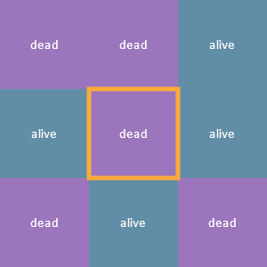
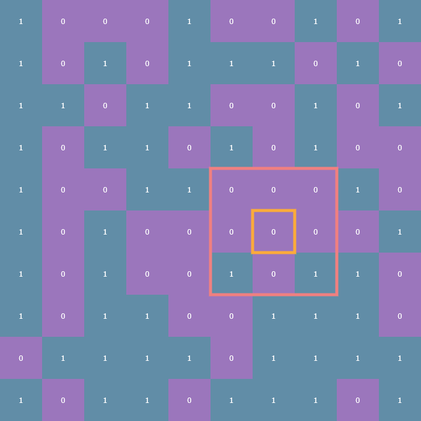
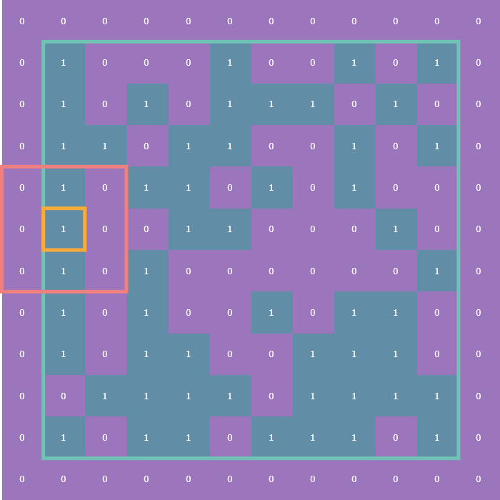
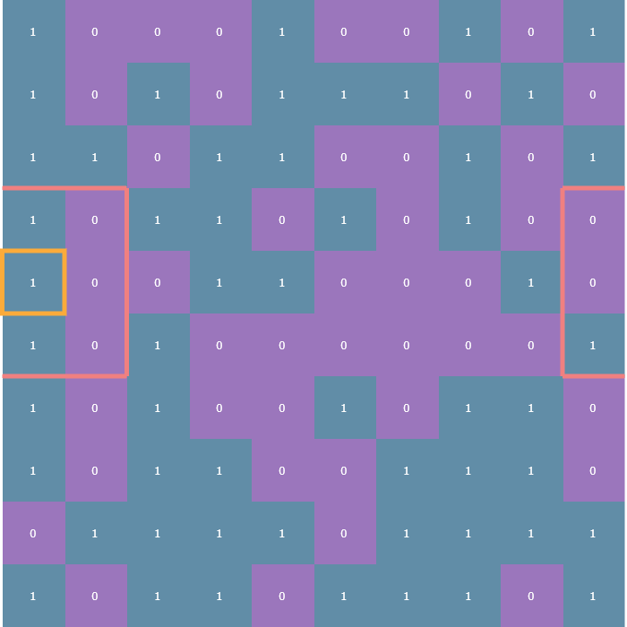
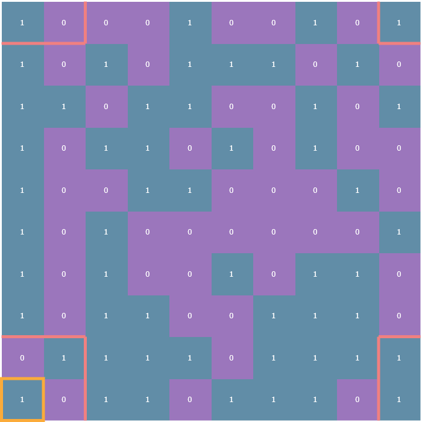
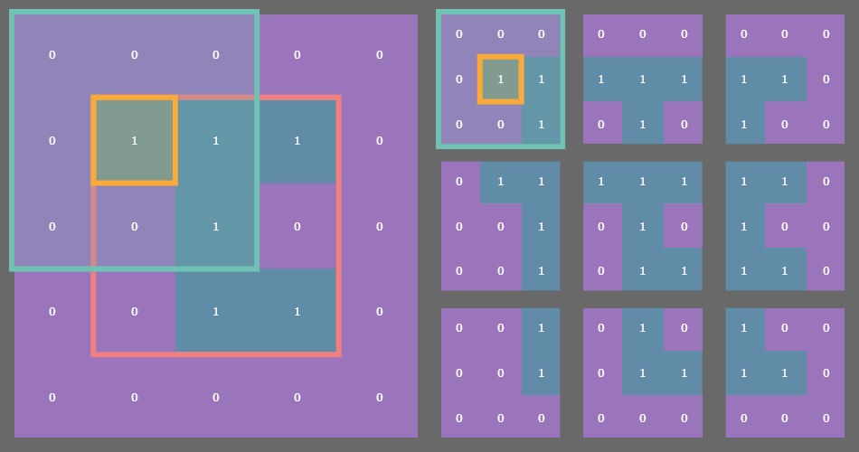
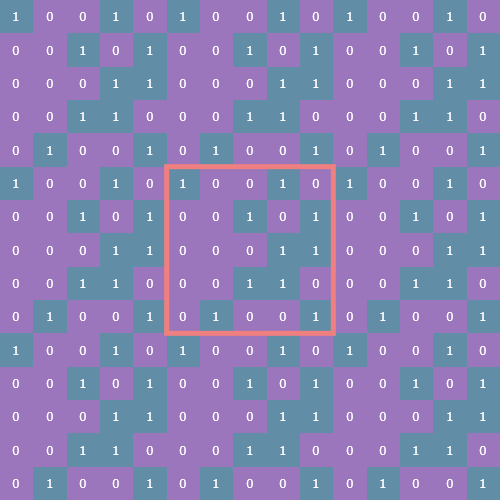
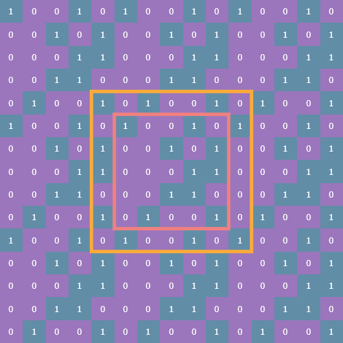

# life

A NumPy-oriented implementation of [Conway's Game of Life](https://en.wikipedia.org/wiki/Conway's_Game_of_Life) with options for fixed or periodic boundary conditions.


## Intro

I had always been very intrigued by [Conway's Game of Life](https://en.m.wikipedia.org/wiki/Conway%27s_Game_of_Life) but had never actually implemented it myself. When I looked up the ruleset, I realized I had no excuse.

For those unfamiliar, Conway's Game of Life is what is known as a [cellular automaton](https://en.m.wikipedia.org/wiki/Cellular_automaton). The Game of Life is a 2-dimensional array of cells which observe a binary state: either on or off, alive or dead. Going forward I'll be referring to this collection of cells as **cells** and the overall state of the cells at any given time as **state**.

The state at time `t` is entirely determined by the state at time `t - 1`, and is governed by this simple rule set:

1. **Underpopulation:** a live cell with zero or one live neighbors dies
2. **Survival:** a live cell with two or three neighbors survives
3. **Overpopulation:** a live cell with four or more live neighbors dies
4. **Reproduction:** a dead cell with exactly three neighbors is reborn

Those are the original rules, but they can actually be consolidated to only three rules:

1. Any live cell with two or three live neighbors survives
2. Any dead cell with exactly three live neighbors becomes a live cell
3. All other live cells die in the next generation (all dead cells stay dead)

[(source)](https://en.m.wikipedia.org/wiki/Conway%27s_Game_of_Life#Rules)

## The algorithm

The basic algorithm for implementing Life is as follows:

1. For a given cell, count how many living neighbors it has
2. Determine whether that cell should die, survive, or be reborn
3. Repeat for all cells

Each cell's **neighborhood** consists of the eight cells adjacent to it (up, down, left, right, and the diagonals). Here's a cell outlined in yellow and its eight neighbors and their statuses:

<p align="center"></p>

## Each cell is a finite automaton!

The word **state** in this section will specifically refer to the status (alive or dead) of an individual cell. Familiarity with [discrete finite state machines](https://en.m.wikipedia.org/wiki/Finite-state_machine) would be helpful here, but is not necessary.

Since there are two states in which a cell can be observed and anywhere from 0 to 8 living neighbors, it's entirely possible to enumerate all the possible state transitions, which is the cartesian product of `{0, 1} x {0, 1, ..., 8}` for a total of 18 possible state transitions:

```python
(0, 0) -> 0
(0, 1) -> 0
(0, 2) -> 0
(0, 3) -> 1
(0, 4) -> 0
(0, 5) -> 0
(0, 6) -> 0
(0, 7) -> 0
(0, 8) -> 0
(1, 0) -> 0
(1, 1) -> 0
(1, 2) -> 1
(1, 3) -> 1
(1, 4) -> 0
(1, 5) -> 0
(1, 6) -> 0
(1, 7) -> 0
(1, 8) -> 0
```

The way to read these state transitions is from left to right: on the left hand side is a 2-tuple containing the current state of any given cell and the number of *living* neighbors it has, and the right hand side is the next state of that cell. So for instance, the state transition `(0, 5) -> 0` applies to any cell which is dead (the `0` in the 2-tuple) and which has five living neighbors (the `5` in the 2-tuple). As you can see, the next state of that cell is 0, meaning the cell stays dead.

Notice that the vast majority of the state transitions are equivalent based on those three rules from earlier. There's no functional difference between `(0, 5) -> 0` and `(0, 7) -> 0`, for example. Taking this into account, there are actually only three state transitions which we really care about:

```python
(1, 2) -> 1
(1, 3) -> 1
(0, 3) -> 1
```

The first two transitions reflect the first rule:

> Any live cell with two or three live neighbors survives

And the third transition corresponds to the second rule:

> Any dead cell with exactly three live neighbors becomes a live cell

Every other possible state (again, a 2-tuple `(alive or dead, number of neighbors)`) results in either a live cell dying or a dead cell staying dead.

## Implementation

Conventionally, one might take a looping approach where each cell is checked and updated individually, cell-by-cell. This approach has several pitfalls: manual indexing (a nightmare), and the necessity for manually updating a new array (you can't update any of the cells until you've checked *all of them* and have determined their next state, since updating one cell could potentially change the number of neighbors of the next cell).

I decided to take advantage of NumPy to simplify the calculations with the tradeoff being that the initial set up was a little bit more complicated to figure out. It may help to have `life.py` open somewhere to which you can refer during the following sections, however the relevant code will also be shown.

### Encoding the rules

The easiest place to start is in encoding the rules of Life. The three state transitions we care about become

```python
RULES = {(1, 2): 1, (1, 3): 1, (0, 3): 1}
```

Choosing this particular data structure meant I needed to write a function which could accept a 2-tuple of the elements from two arrays: the `state` array and the `neighbors` array. For this, I used `np.vectorize()`:

```python
# Relevant type aliases
StateArray = Tuple[np.ndarray, np.ndarray]
StateUpdater = Callable[[StateArray], np.ndarray]

NEXT_STATE: StateUpdater = np.vectorize(lambda x, y: RULES.get((x, y), 0))
```

Let's focus on the type hints in order to break down how the `NEXT_STATE()` function works: the `StateArray` type is an alias for `Tuple[np.ndarray, np.ndarray]`, or a 2-tuple of NumPy arrays, and the `StateUpdater` type is a `Callable` (Python's type hint for functions) which takes as its input a `StateArray` and returns a NumPy array. In other words, `NEXT_STATE()` is a closed binary operation on 2D NumPy arrays of `dtype="uint8"`.

The implementation details of `np.vectorize()` are outside the scope of this article. The takeaway is that `np.vectorize()` will *return a new function* of the type `Callable[[np.ndarray, ...], np.ndarray]`.

The `NEXT_STATE()` function now takes the `state` and `neighbors` arrays as arguments and constructs a new array by getting values based on the `RULES` dictionary lookup. In other words, in order to get the next **generation**, I just need to call `NEXT_STATE(state, neighbors)`.

Unfortunately, `np.vectorize()` is a only convenience method and doesn't truly take advantage of SIMD as far as I can tell, so this particular technique is actually going to end up being a slight bottleneck. We'll come back to this later but for now, this hefty layer of abstraction allows us to focus on the next piece of the puzzle: calculating each cell's number of living neighbors.

### Neighborhoods and boundary conditions

The rules of the Game of Life entirely revolve around how many living neighbors a given cell has. Typically, a **neighborhood** is considered to be the 8 cells surrounding any given cell. For cells not on the edge of the array finding the number of neighbors is trivial, just look at each adjacent cell in all eight directions and count how many of those cells are alive. In the following visualizations, each cell will be annotated with either a 1 or a 0, indicating whether that cell is alive or dead, respectively. Here is an example cell outlined in yellow, and its neighborhood outlined in pink:

<p align="center"></p>

The tricky part comes in how to deal with cells on the edge of the array. These are what are known as **boundary conditions** and there are two variants: the first is the **fixed** boundary condition wherein all the cells adjacent to those on the edge of the array are considered dead (think of it as a wall of zeros surrounding the entire array, which is outlined in turquoise):

<p align="center"></p>

The other is the **periodic** boundary condition which means that each edge of the array essentially "wraps" around to the other side so that, for instance, cells on left edge of the array are considered to be adjacent to the cells on the right edge:

<p align="center"></p>

### Finding `neighbors`

Now, you could write a nested `for` loop over the `r, c` (row, column) coordinates of each neighbor of a given cell:

<p align="center"></p>

But that in and of itself is a nightmare, let alone having to deal with the boundary conditions. Here's what one corner's neighbors look like with periodic boundary conditions:

<p align="center"></p>

No thanks! Instead, we'll "pad" the `state` array with a 1-cell-wide border and use a `(3, 3)` sliding window!

### Stride tricks

NumPy's arrays are truly remarkable. Because they are homogeneous, each element in any given array requires the exact same amount memory as every other element in that array. For example, a six-element vector of `int8` (integers represented using only 8 bits, of which there are `2^8 = 256`) would take up exactly 48 bits (or six bytes) in memory. In the following examples I'll use `dtype="uint8"` which is an **unsigned** integer, so the possible values are 0-255.

```python
>>> import numpy as np
>>> x = np.array(0, 255, size=(6,), dtype="uint8")
>>> x
array([133, 195,  41, 201, 208,  60], dtype=uint8)
>>> x.size * x.itemsize  # itemsize is in units of bytes
6
```

This fixed-memory-per-element constraint allows NumPy to carve out a contiguous chunk of memory in which to store a given array. This in turn makes accessing the elements of an array much faster than, say, Python's `list` type because NumPy doesn't have do any wonky pointer manipulation to jump around your computer's memory in order to grab elements. We can get a feel for this by checking `np.ndarray.strides`:

```python
>>> x.strides
(1,)
```

For a 1D array, this is telling us that in order to "travel" to the next element in the array, we simply need to increment the memory pointer by one byte. This pattern follows for higher-dimensional arrays:

```python
>>> x = np.random.randint(0, 255, size=(3, 3), dtype="uint8")
>>> x.strides
>>> (3, 1)
```

This is telling us that in order to travel to the next *row* we need to increment our pointer by three bytes. Columnar jumps still only require one byte because data in NumPy is stored in column-order by default (and one byte specifically in this case because I'm using `dtype="uint8"`). Take this array for example:

```python
>>> x
array([[218,  19,  18],
       [ 32, 227, 144],
       [152,  44,  64]], dtype=uint8)
```

Moving down one row from `19` takes three bytes; one byte to reach `18`, one byte to reach `32`, and finally one more byte to reach `227` which is directly below `19`. What does any of this have to do with Conway's Game of Life? Well, the way I got around dealing with that indexing nightmare was by padding the original `state` array with a 1-cell-wide border using `np.pad()` and then using a `(3, 3)` sliding window view to check each cell's neighbors!

### Sliding windows

The `np.lib.stride_tricks.sliding_window_view()` function provides a sequence of views of the input array via striding. The implementation details aren't super important, the real key here is that this function returns an array of a very special shape: `(n, n, 3, 3)` where `n` is the original size of the array (I've restricted my implementation to square arrays for a couple reasons I'll talk about in the next article; in general, for an original array of size `(n, m)`, after padding, the sliding window views will be a `(n, m, p, q)` array, where `(p, q)` is the shape of the sliding window you want, assuming that the window shape and the original array shape [work well](https://numpy.org/devreference/generated/numpy.lib.stride_tricks.sliding_window_view.html#numpy-lib-stride-tricks-sliding-window-view) together).

For example, if you have a `state` array which is `(3, 3)` then after padding with a fixed or periodic border of one cell, the sliding window function returns a `(3, 3)` array of `(3, 3)` arrays! See where I'm going with this?

<p align="center"></p>

In the example gif above, the original `state` array of shape `(3, 3)` is outlined in pink on the left. Each cell in the original array is outlined in yellow. The sliding blue window is an animated depiction of iterating through each `(3, 3)` neighborhood of the corresponding cell outlined in yellow. The subarrays on the right are the individual `(3, 3)` neighborhood views produced by the `np.lib.stride_tricks.sliding_window_view()` function, conveniently arranged into a 3x3 shape!

```python
>>> windows = np.lib.stride_tricks.sliding_window_view(np.pad(x, 1), (3, 3))
>>> windows.shape
(3, 3, 3, 3)
```

This is made possible with some fancy striding under the hood by NumPy, leaving us to focus on more pressing matters.

### Counting neighbors

The whole point of this was to figure out how many living neighbors a given cell has. Once we've gotten our `windows` array (remember, its shape is `(n, n, 3, 3)`), we can call `np.sum()` to take the sum of each neighborhood subarray:

```python
windows.sum(axis=(2, 3)) - state
```

The `axis` argument here specifies that we're summing over the third and fourth axes (remember that Python is zero-indexed). One way to think of it is that that each `(3, 3)` neighborhood is "collapsed" down to a scalar which is the sum of the nine elements in that neighborhood (we're dealing with binary data, so summing the values is equivalent to counting the number of ones). By collapsing those third and fourth axes down to a scalar, we end up with an `(n, n)` array of neighbor counts:

```python
>>> windows.sum(axis=(2, 3)).shape
(3, 3)
```

This result will always be a positive integer between 0 and 9, since each of the nine cells in a `(3, 3)` binary array can be 0 or 1. Next, we subtract `state` so that we're not counting the value of any given cell itself when counting its neighbors. Again, we can perform this subtraction because the sum over the third and fourth axes collapses the `(n, n, 3, 3)` array back down to `(n, n)` and the `state` array here is `(n, n)`.

Et voila! We now have two arrays: the `state`, a binary array representing dead and alive cells, and a `neighbors` array of values between 0 and 8. Remember the `NEXT_STATE()` function from before, the vectorized function made out of a dictionary lookup? We can now pass these two `(n, n)` arrays to that function and NumPy will perform the `dictionary` lookups for us and return a new binary array which represents our new `state`.

### Example

Here's a REPL example using a `(2, 2)` array representing the `state` of a given instance of `Life` with the `"fixed"` boundary condition. Here are the padding, sliding window, sum, and subtraction steps encapsulated by the `LifeFactory.neighbors()` function for that `state` array:

First, we'll instantiate a random `(2, 2)` binary array:

```python
>>> import numpy as np
>>> state = np.random.randint(0, 2, (2, 2))
>>> state
array([[1, 0],
       [0, 1]])
```

Next, we'll pad this `state` array:

```python
>>> padded = np.pad(state, 1)
>>> padded
array([[0, 0, 0, 0],
       [0, 1, 0, 0],
       [0, 0, 1, 0],
       [0, 0, 0, 0]])
```

Now obtain the sliding window view:

```python
>>> windows = np.lib.stride_tricks.sliding_window_view(padded, (3, 3))
>>> windows
array([[[[0, 0, 0],
         [0, 1, 0],
         [0, 0, 1]],

        [[0, 0, 0],
         [1, 0, 0],
         [0, 1, 0]]],


       [[[0, 1, 0],
         [0, 0, 1],
         [0, 0, 0]],

        [[1, 0, 0],
         [0, 1, 0],
         [0, 0, 0]]]])
>>> windows.shape
(2, 2, 3, 3)
```

Next, we sum over the third and fourth axes:

```python
>>> window_sum = windows.sum(axis=(2, 3))
>>> window_sum
array([[2, 2],
       [2, 2]])
```

Now, take a second to make sure you understand this result. It may be helpful to look back at the original `state` array directly next to its `padded` version:

```python
>>> state
array([[1, 0],
       [0, 1]])
>>> padded
array([[0, 0, 0, 0],
       [0, 1, 0, 0],
       [0, 0, 1, 0],
       [0, 0, 0, 0]])
```

In each `(3, 3)` neighborhood of the four cells in the `state` array, there are always at least two ones, hence our result

```python
>>> window_sum
array([[2, 2],
       [2, 2]])
```

Finally, by subtracting this collapsed summation by the original state, we arrive at the proper neighbor count:

```python
>>> neighbors = window_sum - state
>>> neighbors
array([[1, 2],
       [2, 1]])
```

Take another second to verify this result:

```python
>>> state
array([[1, 0],
       [0, 1]])
>>> neighbors
array([[1, 2],
       [2, 1]])
```

The top-left cell only has one living neighbor (to its southeast), the top-right cell has *two* living neighbors (one directly west, one directly south), and so on.

Let's revisit the rules of Conway's Game of Life and determine the next generation of this `state` array. For this small example, we'll manually loop through the `state` and `neighbors` in parallel in order to determine the next state:

```python
>>> RULES = {(1, 2): 1, (1, 3): 1, (0, 3): 1}
>>> new_state = []
>>> for i in range(2):
...     new_row = []
...     for j in range(2):
...             rules_input_tuple = state[i, j], neighbors[i, j]
...             rules_lookup = RULES.get(rules_input_tuple, 0)
...             new_row.append(rules_lookup)
...             print("tuple key:", rules_input_tuple)
...     new_state.append(new_row)
...
tuple key: (1, 1)
tuple key: (0, 2)
tuple key: (0, 2)
tuple key: (1, 1)
>>> np.array(new_state)
array([[0, 0],
       [0, 0]])
```

Oops! Both live cells died due to underpopulation, and neither of the previously-dead cells had enough living neighbors in order to be reborn. There you have it though, that's the core logic behind my implementation.

But wait, there's more! We forgot to talk about **periodic boundaries,** and the bottleneck introduced by that dictionary lookup.

### Tile and slice

In retrospect, the logic behind padding `state` with a periodic boundary border is actually shockingly straight-forward. However, I did not have the benefit of hindsight and it took me an afternoon to come up with a more elegant way to figure out this padding method besides a brute force mashing and *frankensteining* of array creation, stacking, and blocking (which is extremely slow and memory-intensive).

For a while I couldn't really wrap my mind around what to do with the corners of each array, but then it dawned on me: caddy-corner cells *must* be adjacent! The way I figured this out was by fiddling with the `np.tile()` function, which takes as input an array `x`, and a desired shape, and *tiles* `x` in a repeating pattern such that it fills out an array of shape `(n*p, m*q)` where `(n, m)` is the shape of `x` and `(p, q)` is the desired shape passed as an argument to `np.tile()`.

Let's take a look at an example. It'll be easier to see what `np.tile()` is doing with a non-binary array:

```python
>>> x = np.array([[1, 2, 3], [4, 5, 6]])
>>> x
array([[1, 2, 3],
       [4, 5, 6]])
>>> pattern = (4, 2)
>>> tiles = np.tile(x, pattern)
>>> tiles
array([[1, 2, 3, 1, 2, 3],
       [4, 5, 6, 4, 5, 6],
       [1, 2, 3, 1, 2, 3],
       [4, 5, 6, 4, 5, 6],
       [1, 2, 3, 1, 2, 3],
       [4, 5, 6, 4, 5, 6],
       [1, 2, 3, 1, 2, 3],
       [4, 5, 6, 4, 5, 6]])
>>> print(x.shape); print(pattern); print(tiles.shape)
(2, 3)
(4, 2)
(8, 6)
```

As you can see, we've simply repeated `x` array with shape `(2, 3)` in a `(4, 2)` pattern (two copies of `x` repeating horizontally, and four copies repeating vertically), resulting in an `(8, 6)` array.

Let's return to binary arrays and look at an example of a `(5, 5)` instance of `Life` (with the original `(5, 5)` array outlined in pink):

<p align="center"></p>

Now we take a slice of the array such that we capture both the original `state` and its periodic border:

```python
np.tile(state, (3, 3))[(s := n-1):-s, s:-s]
```

Here `s` is the size of the `state` array minus 1. Here's what the slice looks like (outlined in yellow):

<p align="center"></p>

This tiled and sliced array is now the `padded` array on which we can perform the sliding window view function, count neighbors, and update `state`.

Of course, I soon realized all of this was unnecessary as there's actually a `mode` parameter for the `np.pad()` function which does all this heavy lifting for you... Oh well, it was a nice exercise.

## Fixing the bottleneck

As mentioned, our dictionary lookup is actually a pretty severe bottleneck on this program. It's not *that* big a deal since the code I'm using to actually create the animated gifs takes quite a while to do so anyway for arrays of shape `(100, 100)` or greater. But there was still noticeable lag when running Life up to the max allowed number of generations (1000).

The issue here is that `np.vectorize()` is a little bit of a misnomer; it's really just a convenience method which allows you to apply a function to two arrays without having to write the `for` loop logic yourself. At the end of the day it's still quite slow in the context of the greater NumPy library. As far as I can tell, `np.vectorize()` doesn't actually **vectorize** your function for you, which is the process by which an algorithm is written in or converted to such a form as to take advantage of your CPU's SIMD capabilities.

Realizing this, and knowing that arithmetic operations *are* properly vectorized in NumPy, I set out to find a closed formula which could calculate the next state of the cells array without resorting to a `dict` lookup. Here's what I came up with:

```python
def next_state(s: np.ndarray, n: np.ndarray) -> np.ndarray:
    return (n < 4) * (1 - s * (n % 2 - 1) + n) // 4
```

While it certainly isn't pretty (and I wouldn't be surprised if it can be reduced), it does an excellent job of opening up that bottleneck:

```python
vectorized dict: 14.12 s
formula: 0.91 s
```

That test was run on a `(1000, 1000)` array, which is *much* larger than my program will even allow the user to input, but it's clear that when possible it's always a good idea to try to find a vectorize-able function!

## Seed generation

I'll write another post about how I decided to deal with seed generation. Originally, the seeds were just monolithic tiles of uniformly distributed binary noise and while they're interesting in their own right, they can also become quite mundane after a couple dozen runs of Life, so I set out (again with trusty NumPy by my side) to come up with more options for random seed generation. Here are a few examples:

<p align="center"></p>

Thanks for reading!

Just kidding, here's an example of Life running on one of these symmetric seeds:

<p align="center"></p>

Okay, thanks for sticking around!
